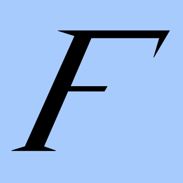

<!-- Improved compatibility of back to top link: See: https://github.com/othneildrew/Best-README-Template/pull/73 -->

<!--
*** Thanks for checking out the Best-README-Template. If you have a suggestion
*** that would make this better, please fork the repo and create a pull request
*** or simply open an issue with the tag "enhancement".
*** Don't forget to give the project a star!
*** Thanks again! Now go create something AMAZING! :D
-->

<!-- PROJECT SHIELDS -->
<!--
*** I'm using markdown "reference style" links for readability.
*** Reference links are enclosed in brackets [ ] instead of parentheses ( ).
*** See the bottom of this document for the declaration of the reference variables
*** for contributors-url, forks-url, etc. This is an optional, concise syntax you may use.
*** https://www.markdownguide.org/basic-syntax/#reference-style-links
-->
[![Contributors][contributors-shield]][contributors-url]
[![Forks][forks-shield]][forks-url]
[![Stargazers][stars-shield]][stars-url]
[![Issues][issues-shield]][issues-url]
[![MIT License][license-shield]][license-url]
[![LinkedIn][linkedin-shield]](https://www.linkedin.com/in/stefano-butera/)

<!-- PROJECT LOGO -->
 

  

<h3 align="center">Factorize</h3>

  

    A node-based no-code automation app
     
    <a href="https://github.com/lud77/Factorize"><strong>Explore the docs »</strong></a>
     
     
    <a href="https://github.com/lud77/Factorize/issues">Report Bug</a>
    ·
    <a href="https://github.com/lud77/Factorize/issues">Request Feature</a>
  

<!-- TABLE OF CONTENTS -->

  
Table of Contents

  <ol>
    <li>
      <a href="#about-the-project">About The Project</a>
      <ul>
        <li><a href="#built-with">Built With</a></li>
      </ul>
    </li>
    <li>
      <a href="#getting-started">Getting Started</a>
      <ul>
        <li><a href="#installation">Installation</a></li>
        <li><a href="#usage">Usage</a></li>
      </ul>
    </li>
    <li><a href="#roadmap">Roadmap</a></li>
    <li><a href="#contributing">Contributing</a></li>
    <li><a href="#license">License</a></li>
    <li><a href="#contact">Contact</a></li>
  </ol>

<!-- ABOUT THE PROJECT -->
## About The Project

![Factorize Screen Shot][product-screenshot]

Factorize is a node-based no-code platform for doing automation the easy way. Given the proliferation of node-based UI for scripting any kind of software tool, it should be easy for anybody to recognize what Factorize is and how it works.

Factorize allows you to script your entire system! With Factorize you can easily design complex routines without using a scripting language.

Chosse from any of tens of inputs, outputs and actions, and start experimenting!

(<a href="#readme-top">back to top</a>)

### Built With

[![React][React-badge]][React-url]
[![Electron][Electron-badge]][Electron-url]
[![Typescript][Typescript-badge]][Typescript-url]

(<a href="#readme-top">back to top</a>)

<!-- GETTING STARTED -->
## Getting Started

The project is still a work-in-progress, but here you can find instructions on how to
install the project on your machine and try it out or make changes.

### Installation

To install with yarn:

    $ git clone git@github.com:lud77/Factorize.git
    $ cd Factorize
    $ yarn

(<a href="#readme-top">back to top</a>)

### Usage

To start the dev version just enter the project folder and run:

    $ npm run dev

To send a message to a socket-listener panel, use:

    $ node bin/send --topic XXXX --message YYYY

where XXXX is the name of the panel's channel and YYYY is the actual message

(<a href="#readme-top">back to top</a>)

<!-- ROADMAP -->
## Roadmap

See `TODO.md` for a list of planned features and changes.

See the [open issues](https://github.com/lud77/Factorize/issues) for a full list of proposed features (and known issues).

(<a href="#readme-top">back to top</a>)

<!-- CONTRIBUTING -->
## Contributing

Contributions are what make the open source community such an amazing place to learn, inspire, and create. Any contributions you make are **greatly appreciated**.

If you have a suggestion that would make this better, please fork the repo and create a pull request. You can also simply open an issue with the tag "enhancement".
Don't forget to give the project a star! Thanks again!

1. Fork the Project
2. Create your Feature Branch (`git checkout -b feature/AmazingFeature`)
3. Commit your Changes (`git commit -m 'Add some AmazingFeature'`)
4. Push to the Branch (`git push origin feature/AmazingFeature`)
5. Open a Pull Request

(<a href="#readme-top">back to top</a>)

<!-- LICENSE -->
## License

Distributed under the GPL License. See `LICENSE.txt` for more information.

(<a href="#readme-top">back to top</a>)

<!-- CONTACT -->
## Contact

**Stefano Butera** 
Linkedin: [Stefano Butera](https://www.linkedin.com/in/stefano-butera/) 
Mastodon: [@stefano_butera](https://mastodon.social/@stefano_butera)

**Factorize** 
Github: [lud77/Factorize](https://github.com/lud77/Factorize) 
Mastodon: [@factorize](https://mastodon.social/@factorize)

(<a href="#readme-top">back to top</a>)

<!-- MARKDOWN LINKS & IMAGES -->
<!-- https://www.markdownguide.org/basic-syntax/#reference-style-links -->
[React-badge]: https://img.shields.io/badge/-React.Js-61DAFB?logo=react&logoColor=000&style=for-the-badge
[Typescript-badge]: https://shields.io/badge/TypeScript-3178C6?logo=TypeScript&logoColor=FFF&style=for-the-badge
[Electron-badge]: https://img.shields.io/badge/Electron.Js-9FEAF9?style=for-the-badge&logo=electron&logoColor=1B1C26
[React-url]: https://reactjs.org/
[Typescript-url]: https://www.typescriptlang.org/
[Electron-url]: https://www.electronjs.org/
[contributors-shield]: https://img.shields.io/github/contributors/lud77/Factorize.svg?style=for-the-badge
[contributors-url]: https://github.com/lud77/Factorize/graphs/contributors
[forks-shield]: https://img.shields.io/github/forks/lud77/Factorize.svg?style=for-the-badge
[forks-url]: https://github.com/lud77/Factorize/network/members
[stars-shield]: https://img.shields.io/github/stars/lud77/Factorize.svg?style=for-the-badge
[stars-url]: https://github.com/lud77/Factorize/stargazers
[issues-shield]: https://img.shields.io/github/issues/lud77/Factorize.svg?style=for-the-badge
[issues-url]: https://github.com/lud77/Factorize/issues
[license-shield]: https://img.shields.io/github/license/lud77/Factorize.svg?style=for-the-badge
[license-url]: https://github.com/lud77/Factorize/blob/master/LICENSE.txt
[linkedin-shield]: https://img.shields.io/badge/-LinkedIn-black.svg?style=for-the-badge&logo=linkedin&colorB=555
[product-logo]: ret/logo.png
[product-screenshot]: ret/screenshot-2.png
